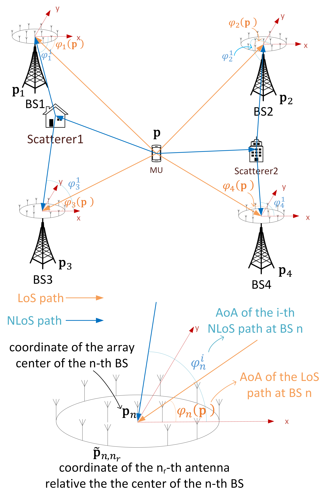
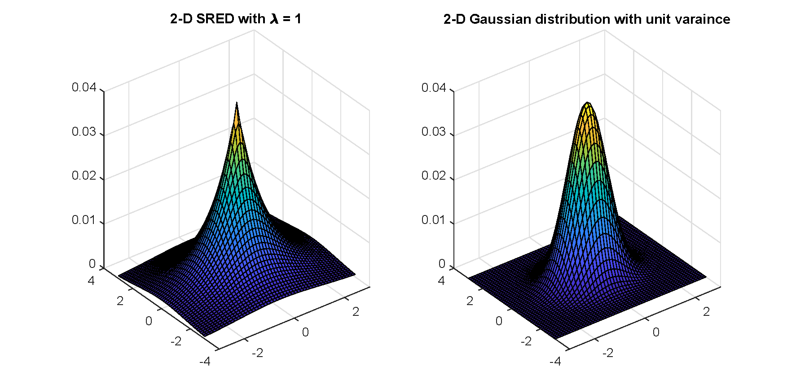

# Localization & Channel Estimation
 This repository contains the source codes of the paper "Joint channel and location estimation of massive MIMO system with phase noise", which is published in IEEE Transactions on Signal Processing (see https://ieeexplore.ieee.org/abstract/document/9072407).
 
In this paper, we introduced a sparse representation model for the channel with dynamic-grid parameters to eliminate the location quantization error and derived an approximation for the likelihood with the presence of PHN. Based on these, we proposed an efficient algorithm for joint estimation of user location and sparse channel of the massive MIMO system.

We imposed a SRED prior distribution on the channels to capture the structured sparsity in the angular-delay domain.

# Introduction of the codes
Run "main_loc.m" to implement the proposed algorithm.

# Note
You may cite us by
@ARTICLE{9072407,
author={Zheng, Xuanyu and Liu, An and Lau, Vincent},
journal={IEEE Transactions on Signal Processing},
title={Joint Channel and Location Estimation of Massive {MIMO} System With Phase Noise},
year={2020},
volume={68},
pages={2598-2612},
doi={10.1109/TSP.2020.2986551}}
